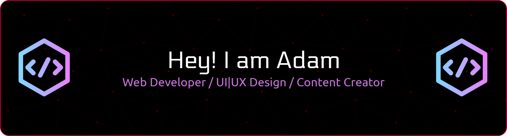

## 🌐 Socials:
 

# 💻 Tech Stack:
             
# 📊 GitHub Stats:
 
 

---

  ## 💰 You can help me by Donating
   

  
<!-- Proudly created with GPRM ( https://gprm.itsvg.in ) -->

<picture>
  <source media="(prefers-color-scheme: dark)" srcset="https://raw.githubusercontent.com/Defaul00/Defaul00/output/pacman-contribution-graph-dark.svg">
  <source media="(prefers-color-scheme: light)" srcset="https://raw.githubusercontent.com/Defaul00/Defaul00/output/pacman-contribution-graph.svg">
  
</picture>

###

###